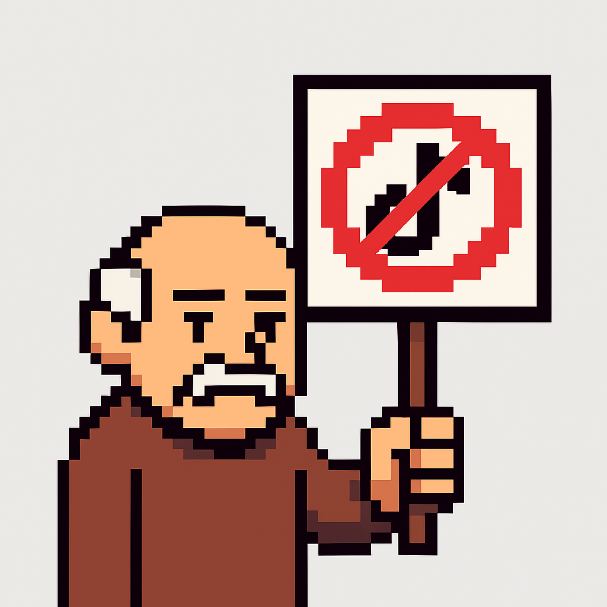

# Shorts & Stories Blocker

A browser extension that removes YouTube Shorts and Facebook Stories from your browsing experience, helping you stay focused and avoid distracting short-form content.



## Features

- **YouTube Shorts Removal**: Hides all Shorts content including shelf sections, sidebar links, and individual Shorts videos
- **Facebook Stories Removal**: Removes Stories sections, story trays, and story creation buttons
- **Toggle Controls**: Easily enable/disable blocking for each platform independently via popup interface
- **Instant Updates**: Changes take effect immediately without page refresh
- **Lightweight**: Minimal performance impact using efficient CSS-based blocking

## Installation

### From Source
1. Clone this repository or download the source code
2. Open Chrome/Edge and navigate to `chrome://extensions/`
3. Enable "Developer mode" in the top right
4. Click "Load unpacked" and select the extension directory
5. The extension icon will appear in your toolbar

## Usage

1. Click the extension icon in your browser toolbar
2. Use the toggle switches to enable/disable blocking:
   - **Block YouTube Shorts**: Removes all Shorts content from YouTube
   - **Block Facebook Stories**: Removes all Stories content from Facebook
3. Changes apply immediately - no page refresh needed

## How It Works

The extension uses content scripts injected into YouTube and Facebook pages. When enabled, it adds a CSS class to the page body that triggers rules to hide specific elements. This approach ensures:
- Clean toggling without JavaScript/CSS conflicts
- Persistent blocking across page navigation
- No broken page layouts when content is hidden

## Files Structure

```
├── manifest.json           # Extension configuration
├── popup.html             # Popup interface HTML
├── popup.js               # Popup toggle logic
├── youtube-blocker.js     # YouTube content script
├── youtube-styles.css     # YouTube hiding rules
├── facebook-blocker.js    # Facebook content script
├── facebook-styles.css    # Facebook hiding rules
├── icon16.png
├── geezer.png
├── icon48.png
└── icon128.png
```

## Permissions

The extension requires minimal permissions:
- `storage`: To save your toggle preferences
- Host permissions for `*.youtube.com` and `*.facebook.com`: To inject content scripts

## Privacy

This extension:
- Does not collect any user data
- Does not track your browsing activity
- Stores preferences locally in your browser
- Works entirely offline after installation

## Browser Compatibility

- Chrome/Chromium-based browsers (Chrome, Edge, Brave, etc.)
- Manifest V3 compatible

## Contributing

Contributions are welcome! Feel free to:
- Report bugs or issues
- Suggest new features
- Submit pull requests

## License

None. It's free and Open Source. What else do you want from me? Want to build a billion dollar ARR copmany off of this thing (Redis?) - go ahead!

## Support

If you encounter any issues or have questions, please open an issue on GitHub.
